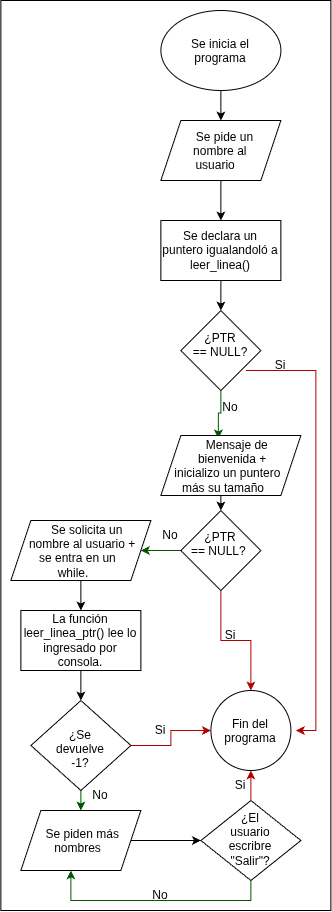
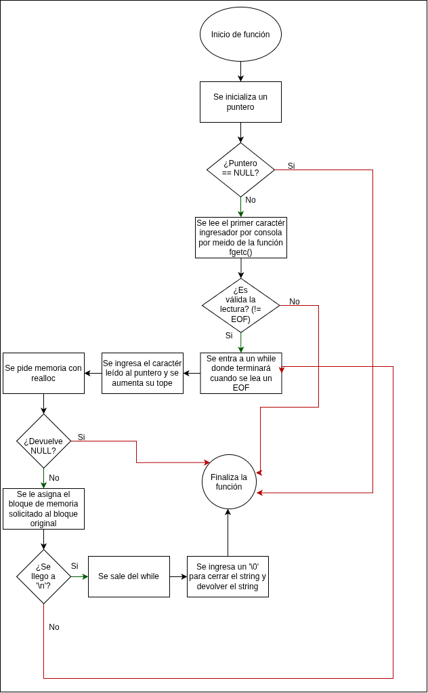
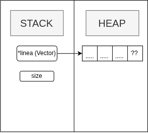
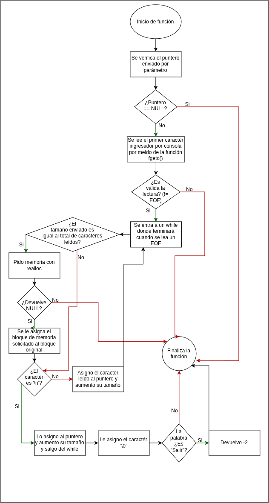
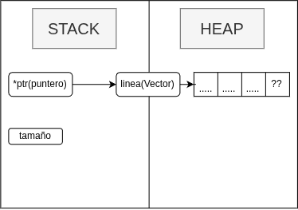

<center> 

# TP0 - Lectura de buffer 

</center> 

---
<br>

- **Alumno** = Constantino Valentín Navarro
- **Padrón** = 114821
- **Mail** = cvnavarro@fi.uba.ar
- **User de github** = cvnavarro06

---
<br>

## Índice
* [1. Instrucciones](#1-Instrucciones)
  * [1.1. Compilar el proyecto](#11-Para-Compilar-el-programa)
  * [1.2. Ejecutar el programa con Valgrind](#12-Para-ejecutar-el-programa-con-Valgrind)
* [2. Funcionamiento](#2-funcionamieto)
* [3. Decisiones de diseño](#3-decisiones-de-diseño)
  * [3.1. Diagrama de memoria](#31-Diagrama-de-memoria)
* [4. Respuestas a las preguntas teóricas](#4-Respuestas-a-las-preguntas-teóricas)
  * [4.1 Pregunta 1](#41-pregunta-1)
  * [4.2 Pregunta 2](#42-pregunta-2)


## 1. Instrucciones

- ### 1.1 Para compilar el programa
```
gcc -g src/main.c -o tp0
```
- ### 1.2 Para ejecutar el programa con valgrind
>Recuerde compilar el programa con el flag -g para poder utilizar este programa.
```
valgrind ./tp0 
```

## 2. Funcionamieto

El programa simula una especie de portal de un profesor, el cual irá añadiendo alumnos cuantas veces quiera hasta que el mismo decida cerrar el programa.

Primero se pedirá que el usuario ingrese un nombre para reconocerlo, el encargado de registrar lo que ingresa el usuario será la función `leer_linea()`.<br>
Lo que hará la función es, primeramente, crear una variable puntero en donde se irá almacenando lo que se haya enviado por consola. La función devolverá **NULL** en caso de que suceda algún error a la hora de solicitar memoría.

Luego se inicializará una variable puntero en donde lo acompaña un tamaño fijo, dicha variable será enviada como parámetro a la función `leer_linea_ptr()`, la misma se encargará de leer lo ingresado por el usuario mediante consola y verificará si el tamaño es apropiado o necesita más espacio para que pueda ser almacenado en el puntero, en caso de ser así, solicitará memoría hasta que entre cada caracter, incluido el `enter` ingresado por el usuario.<br>
En caso de que no se le pueda asignar memoría por un error, o por error a la hora de leer el texto ingresado por consola, la función devolverá **-1**, caso contrario, devolverá la cantidad de caracteres que ocupa el texto.

En base a la segunda función, la misma tiene un proposito de estár en un `while`, ya que la misma esperará a que se ingresen nombres hasta que el usuario quiera salir, el mismo podrá hacerlo escribiendo por consola la palabra reservada `'Salir'`.

### Funcionamiento de [test.c](test.c)

<div align="center">
	
</div>

---
### Funcionamiento de la funcion `leer_linea()`
<div align="center">
	
</div>

---

#### Diagrama de memoria de la función `leer_linea()`

<div align="center">
  
</div>

>Para esta función se implemento una estructura/diseño dicha [acá](#funciones-de-leer_lineac)
---

### Funcionamiento de la funcion `leer_linea_ptr()`
<div align="center">
	
</div>

---

#### Diagrama de memoria de la función `leer_linea_ptr()`

<div align="center">
  
</div>

>Para esta función se implemento una estructura/diseño dicha [acá](#funciones-de-leer_lineac)

#### ACLARACIÓN

A diferencia de leer_linea(), esta función va a apuntar a un puntero ya inicializado `linea(vector)` el cual a este puntero se le va a asignar la memoria a solicitar, en caso de ser necesario. 

## 3. Decisiones de diseño
Para que este programa pueda complementarse bien con las funciones de [leer_linea.c](src/leer_linea.c), quise contextualizar el mismo en una especie de portal de profesor para que agregue a alumnos a un sistema (claramente ficticio).

### Funciones de `leer_linea.c`

Metiendonos más profundo en las funciones del archivo anteriormente mencinado, a la hora de pensar una solución, encontre una función de la biblioteca `<stdio.h>` (Biblioteca del estándar **C99**) la cuál es `fgetc()` la cuál permite una lectura de tipo caractér por caractér hasta un límite que yo le indique, principalmente puede ser un salto de línea o hasta que no haya nada escrito (**Basura**). Mientras que la lectura va sucediendo, yo iré reservando memoria de forma dinámica hasta el límite marcado (Ese caso sucede en la función `leer_linea()`).

## 4. Respuestas a las preguntas teóricas

### 4.1 Pregunta 1

#### Explicar cómo funcionan los strings en C

En C no existen como tal los “strings” de forma nativa, a diferencia de otros lenguajes, en C la forma de representarlos es mediante vectores (**arrays**) y la forma de representarlos es que en el tope del vector se debe de “cerrar” el mismo con el siguiente caracter ‘\0’, al incluir este caracter especial llamado <u>“caracter nulo”</u>, C, interpreta que es ahí donde finaliza dicha cadena de caracteres.

#### Ejemplo:
```
#include <stdio.h>

#define MAX_VECTOR 10

int main()
{
  char vector[MAX_VECTOR] = {’H’, ‘o’, ‘l’, ‘a’, ‘\0’};

  printf("Hola %s", vector); 

  return 0;
}

Output: Hola
```
>Como se ve en el ejemplo, aun que haya un caracter nulo, no se mostrará ya que solamente existe para que C sepa que ahí termina la cadena de caracteres.

### 4.2 Pregunta 2

#### Explicar el funcionamiento de las primitivas `malloc` y `free`.

Por un lado tenemos a la función `malloc`, propia de la biblioteca <u><stdlib.h></u>, la cuál se encargará de solicitar memoría al sistema de manera que si el sistema le presta memoria, devolverá un bloque con la memoria solicitada, en caso contrario, devolverá un bloque con una dirección que apunta a NULL.

Para entender un poco mejor, veámos sus parámetros y su tipo de **return**:

```
void* malloc(size_t tamanio);
|                    |
|                    |
-                    ----> Luego tenemos al parámetro que indicará 
Por un lado                el tamaño del bloque de memoria que queremos
tenemos al tipo            solicitar. El tipo de dato es un número no
void* el cual              negativo.
funciona como un
tipo "comodín"
ya qué representa
un puntero a
cualquier tipo
de dato.
```

Por otro lado tenemos a la función `free()`, la cual se encargará de liberar o devolver la memoria prestada por el sistema al sistema.
El uso de esta función es vital a la hora de solicitar memoria ya que si no devolvemos la memoria prestada, cuando el programa finalice, dicha memoria prestada no volverá al sistema, por ende se perderá para siempre.

Veamos su estructura:
```
void free(void *ptr);
                |
                |
                ---> El parámetro esperado es puntero el cuál tenga memoría solicitada previamente por malloc u otra función alloc.
```